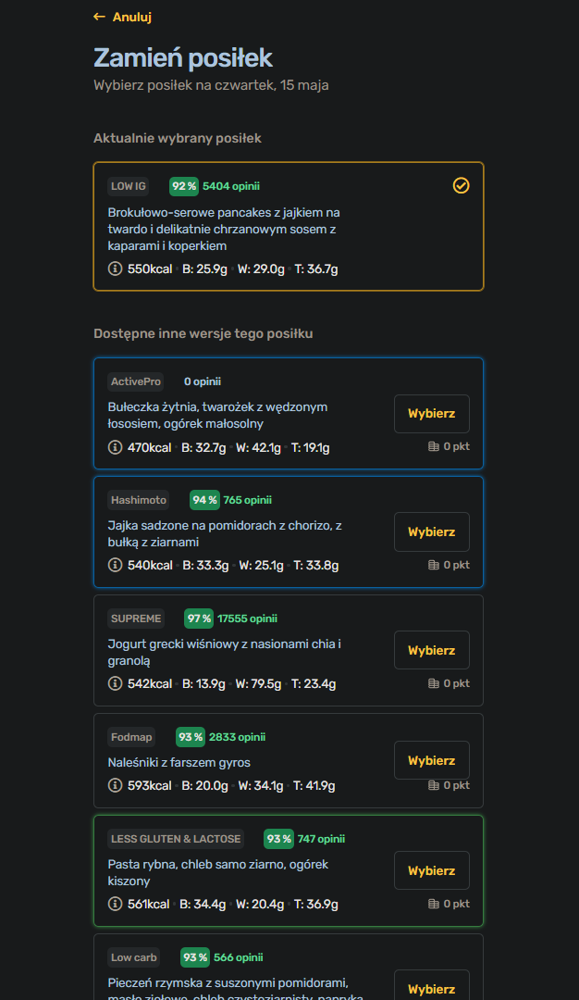
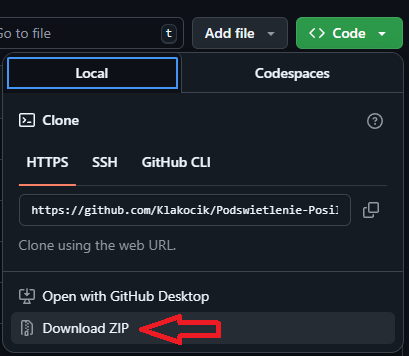
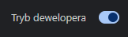
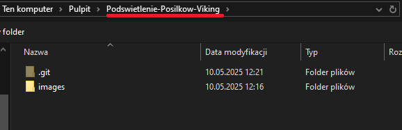
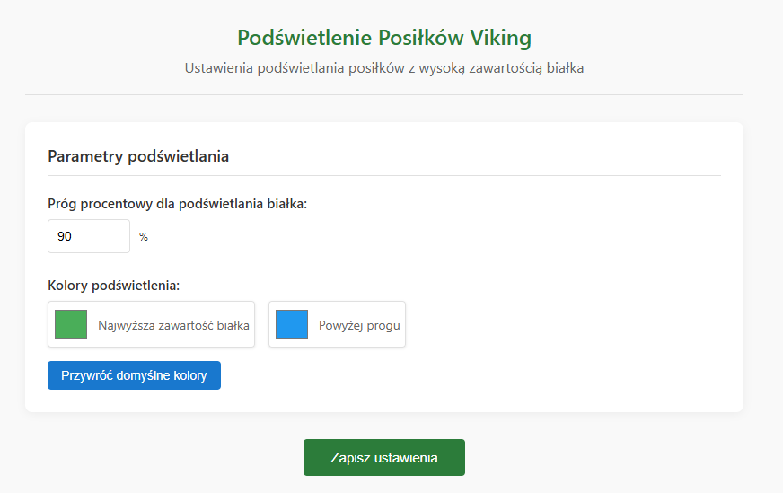

# Podświetlenie Posiłków Viking

 

> Rozszerzenie do przeglądarki Chrome, które podświetla posiłki z wysoką zawartością białka na stronie panel.kuchniavikinga.pl.

## 📋 Spis treści

- [Funkcje](#-funkcje)
- [Instalacja](#-instalacja)
- [Użytkowanie](#-użytkowanie)
- [Konfiguracja](#-konfiguracja)
- [Uwagi](#-uwagi)
- [Licencja](#-licencja)

## ✨ Funkcje

- ✅ Automatycznie wykrywa i podświetla posiłki z wysoką zawartością białka
- ✅ Podświetla posiłek z najwyższą zawartością białka na zielono (domyślnie)
- ✅ Podświetla posiłki z zawartością białka powyżej konfigurowalnego progu na niebiesko (domyślnie)
- ✅ Konfigurowalny próg procentowy (domyślnie: 90%)
- ✅ Możliwość dostosowania kolorów podświetlenia
- ✅ Szybkie przywracanie domyślnych ustawień kolorów

## 🚀 Instalacja

### 1. Pobierz, a następnie **wypakuj** to repozytorium  
  
### 2. Otwórz Chrome i przejdź do `chrome://extensions/`  
### 3. Włącz "Tryb developera" przełącznikiem w prawym górnym rogu  
  
### 4. Kliknij "Załaduj rozpakowane" i wybierz katalog zawierający pliki rozszerzenia  
  
### 5. Ikona rozszerzenia powinna pojawić się na pasku narzędzi przeglądarki (możę być schowana w menu rozwijanym przycisku rozszerzeń (puzzel))  
  

## 🍽️ Użytkowanie

1. Odwiedź stronę panel.kuchniavikinga.pl i otwórz szufladę wyboru posiłków
2. Rozszerzenie automatycznie podświetli posiłki na podstawie zawartości białka:
   - Posiłki z najwyższą zawartością białka będą podświetlone na zielono (domyślnie)
   - Posiłki z zawartością białka powyżej progu będą podświetlone na niebiesko (domyślnie)

## ⚙️ Konfiguracja

1. Kliknij ikonę rozszerzenia na pasku narzędzi
2. Kliknij "Otwórz ustawienia", aby przejść do strony opcji
3. Ustaw próg procentowy używając pola numerycznego
4. Zmień kolory podświetlenia używając selektorów kolorów
5. Kliknij "Zapisz ustawienia", aby zastosować zmiany

## 📄 Licencja

Ten projekt jest otwartoźródłowy.

---

Stworzone z ❤️ dla społeczności Viking od Kuchni